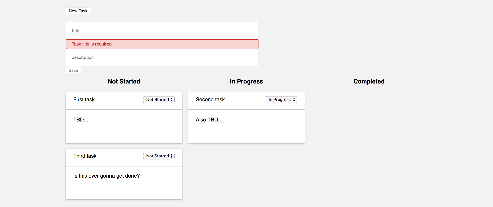
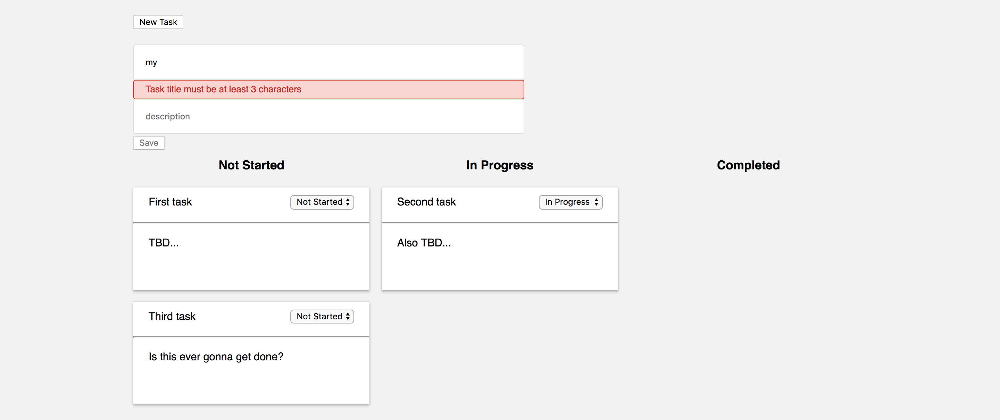

Mandatory Exercise 3 - Angular
==============================

**The deadline for this exercise is Tuesday May 21, 07.59.**

For this **mandatory exercise 3** you should work on **master branch only**.

## Preparation

1. Create a new repository on [Github](github.com) called **mandatory-angular**

2. Follow the instructions that Github gives you; create a local repository and add a remote or clone
the recently created repository.

## Submission

When you do the submission of your exercise in Ping Pong, **before the deadline**,
you will enter the link to your repository, such as:

```
https://github.com/mygithubusername/mandatory-angular
```

The teacher will look in the **master branch**. If any commits are done to the master branch after the deadline, the grade IG will follow.

You will either get **G** or **IG** on the mandatory exercises.

## Instructions

Your job is to implement a Trello-like task board, allowing the user to create tasks that can be moved through three different stages. A task is created with a title and a description entered by the user.

Once you've completed the exercise the task board should look as follows:


As shown above, a task can have one of three status types (and thus reside in one of the three columns displayed):

*   Not Started
*   In Progress
*   Completed

The default status for a task when it's created is Not Started. Each task on the board has a dropdown menu where another status can be selected, in which case it's moved to the corresponding column. A task can be moved back and forth between the columns at any time.

When the user clicks on the New Task button, a form is displayed (click on the button again to hide the form):


The user enters a *required* title and an *optional* description and clicks Save, creating a new task that is added to the Not Started column (and also hiding the form):


The form performs validation on the title field as follows:

*   Check that the title field is not empty
*   Check that the title length is equal to or more than the required minimum length (>= 3 characters)

The maximum length for the title field is 30 characters.

Validation should be performed as the user enters a value for the title field. E.g., if the user clicks in the title field and then moves the focus away, the following error message should be displayed:



Once the user starts typing, while the title length is less than the minimum length, the following error message is shown:



As the images indicate, the Save button is also disabled while the form values are not valid.

### Components

The `src/app` folder contains a number of generated components. You need to determine how the components interact with each other and add the relevant TypeScript code to make them work. 

*   TaskBoardComponent - `/taskboard`

    The main component rendered by AppComponent (see `app.component.html`).

    Responsible for rendering instances of TaskListComponent - one for each status type - and toggling the TaskFormComponent when the user clicks the New Task button.

*   TaskListComponent - `/tasklist`

    Renders a column for a particular status type, with all the tasks that have that status type set.

    Used as follows in a template:

    ```html
    <task-list [statusType]="...">
    </task-list>
    ```

    where `...` should be a one of the three defined status types.

*   TaskComponent - `/task`

    Renders a single task with a title and a description, along with a dropdown menu with the task's current status selected.

    Used as follows in a template:

    ```html
    <task 
     [task]="task"
     (statusChanged)="handleStatusChanged($event)">
    </task>
    ```

    where `task` (that the `[task]` property binds to) is a task object, and the event binding `(statusChanged)` provides the new status (= the value of `$event`) that the user has selected for the task.

*   TaskFormComponent - `/taskform`

    Renders the form used to create a new task. Allows for event binding to a `taskAdded` event (when the user clicks Save):

    Used as follows in a template:

    ```html
    <task-form (taskAdded)="handleTaskAdded($event)">
    </task-form>
    ```

    where `$event` is simply `true`.

Each component has a template file that already contains some markup; your job is to complete each template as needed.

### Services

The following services have been generated:

*   `UtilService`

    Contains a single method `getStatusTypes()`, that returns all status types as a string array.

    You should not add anything else to this service.

*   `TaskService`

    Contains the following empty methods that you must complete:

    *   `getTask(status: StatusType)`

        Returns an Observable of a task array, filtered to only contain the tasks with the status specified by the `status` parameter.

    *   `updateTask(id: number, status: StatusType)`

        Updates the status of the task with the passed in task id.

    *   `addTask(title: string, desription: string)`

        Adds a new task with the passed in title and description.

### Constants

The file `constants.ts` contains an enumeration of task status types and an interface for a task object; these are used throughout the components and services described above.

## Implementation Tips

A few pointers as you work to complete this exercise:

*   `TaskService`:

    Should maintain an internal array of `Task` objects, as well as a counter for getting the next task id when creating a new task.

    Use an instance of `BehaviorSubject` inside the class and initialize it with the internal array; in the `getTasks` method, return a filtered observable using the following code:

    ```javascript
    // assuming this.subject exists...
    return this.subject.asObservable()
        .map(tasks => tasks.filter(task => task.status === status));
    ```

*   You should subscribe to the observable returned by `getTasks` in the `ngOnInit` lifecycle method in one of the      
    components described earlier (you determine which one). Remember to save the subscription handle and call its `unsubscribe` method in the the component´s `ngOnDestroy` lifecycle method.

# mandatory-angular
